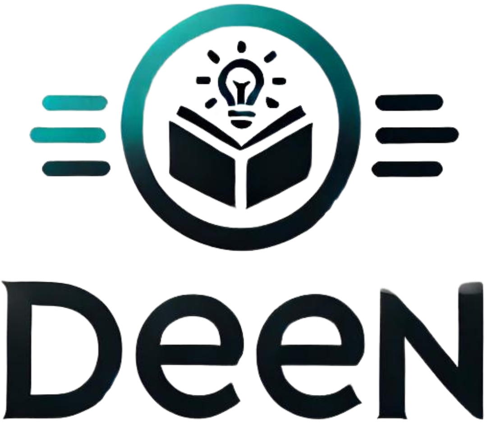

# Deen Blog
**Deen Blog** is designed as a personal platform for sharing content in a minimalist way. It was created to provide a user-friendly experience for non-technical users while giving the admin flexibility to manage the content seamlessly.

## Project Goals
The goal of Deen Blog was to create a flexible and lightweight platform for content creators, where the user experience and ease of use are prioritized. The platform also includes an admin dashboard for easy management of blog posts. Key objectives include:
- **User-friendly UI**: Simple, intuitive navigation for both users and admin.
- **Secure authentication**: Login validation to prevent unauthorized access.
- **Scalable structure**: A database structure optimized for growth and content management.

## Features
- **Responsive design** for mobile and desktop users.
- **Admin dashboard** to create, edit, and delete blog posts.
- **Search functionality** to allow users to quickly find posts.
- **Database management** using MySQL for post storage and retrieval.
- **Form validation** for secure user login.

## Screenshots

### Homepage & View Content

### Login & Create Account

### Create & Manage Posts
